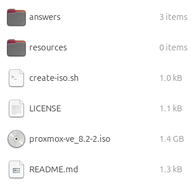
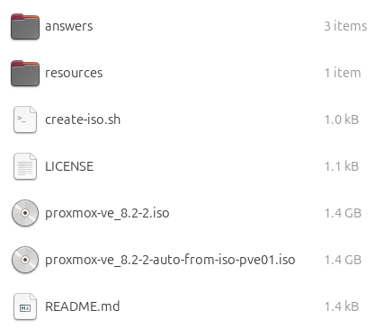

# Proxmos Automatic Installation

Create  an installation `.iso` that can automatically install and perform the basic configure of a proxmox instance. 

## Description

These steps are meant to setup the base instance of a proxmox instance. To further configure the instance, I recommend using ansible. 

More information about the automatic installation process and configuration options can be found in the [official documentation](https://pve.proxmox.com/wiki/Automated_Installation) from proxmox.

## Requirements

You'll need to manually do the following:

1. Download the latest version of the [
Proxmox VE ISO Installer](https://www.proxmox.com/en/downloads) (currently 8.2-2) and place it in the root directory of this repo.

    

2. Ensure `proxmox-auto-install-assistant` is installed on the machine you are creating the `.iso` from.
    1. Command: `apt install proxmox-auto-install-assistant`
3. Create an `answer-MY_HOSTNAME.toml` file in the `answers/` directory.
    1. The hostname of the server should also be in the name of answers file (i.e. `answer-pve01.toml`).

## Executing

1. Execute the `create-iso.sh` script and pass in the hostname of the server you want to create the `.iso` for. Example: `./create-iso.sh pve01`
2. Burn the resulting `.iso` to a usb drive and install.

    
