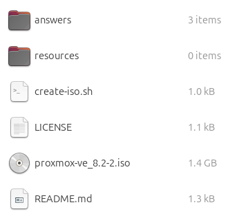
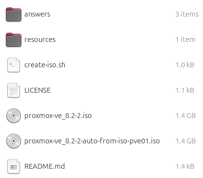

# Proxmox Automatic Installation

Create an installation `.iso` that can automatically install and perform the basic configure of a Proxmox Virtual Environment (PVE) or Proxmox Backup Server (PBS) instance.

## Description

This repository contains simple instructions and a script that can help streamline the [automated installation process](https://pve.proxmox.com/wiki/Automated_Installation) for proxmox.

## Requirements

You'll need to manually do the following:

1. Download the latest version of the installer `.iso` and place it in the root directory of this repo.
    
    - [Proxmox VE ISO Installer](https://www.proxmox.com/en/downloads/proxmox-virtual-environment) (currently 9.2-1) 
    - [Proxmox Backup Server ISO Installer](https://www.proxmox.com/en/downloads/proxmox-backup-server) (currently 4.2-1) 

    Example using Proxmox VE, version 8.2-2

    

2. Ensure `proxmox-auto-install-assistant` is installed on the machine you are creating the `.iso` from.
    1. Command: `apt install proxmox-auto-install-assistant`
3. Create an `answer-MY_HOSTNAME.toml` file in the `answers/` directory.
    1. The hostname of the server should also be in the name of answers file (i.e. `answer-pve01.toml`, `answer-pbs01.toml`).
    2. All answer file configurations can be found [here](https://pve.proxmox.com/wiki/Automated_Installation#Answer_File_Format_2).

## Executing

1. Execute the `create-iso.sh` script and pass in:

    - The proxmox type, `pve` or `pbs`
    - The hostname of the server you want to create the `.iso` for.

    Example:
    
    - `./create-iso.sh pve pve01`
    - `./create-iso.sh pbs pbs01`

2. Flash the resulting `.iso` to a usb drive using balenaEtcher (or a similar tool).

    

3. Plug the usb drive into your server and boot to auto install. 

## First Boot

Each answer file is configured to run a `first-boot-pve.sh` or `first-boot-pbs.sh` script on the first boot after installation. This script:

1. Disables the enterprise repository (avoids apt errors/nags without a subscription).
2. Enables the no-subscription repository.
3. Removes the subscription nag from the web UI.
4. Runs `apt update && apt dist-upgrade`, then reboots.

This means the node will reboot itself once automatically after install before it's ready to use. After that reboot, the node is on up-to-date packages with working repos, ready for further configuration (e.g. via Ansible).

If the [community post-install scripts](https://github.com/community-scripts/ProxmoxVE/blob/main/tools/pve/post-pve-install.sh) that this is based on ever change in a meaningful way, a [scheduled workflow](.github/workflows/community-script-watcher.yaml) will open an issue here as a reminder to review and update `first-boot-*.sh`.

## Issues

1. I've occasionally ran into the following error during installation, but if you reboot (`CTRL-D`) it ends up working on the second attempt.

    > Installation failed: low level installer returned early: unable to initialize physical volume /dev/sda3
    >
    > Auto-installation failed (exit-code 1) - see above for errors.
    >
    > Installation aborted - unable to continue (type exit or CTRL-D to reboot)

